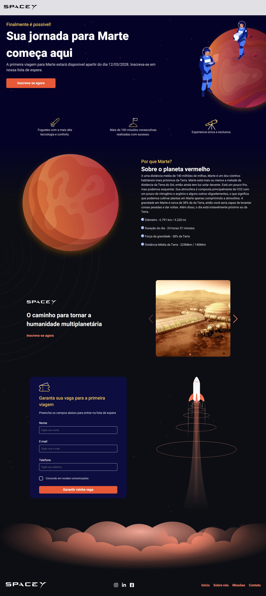

  

# Desktop

<h1 align="center">
    
</h1>

 

## 💻 Tecnologias

Este projeto foi desenvolvido utilizando as seguintes tecnologias:

- [ReactJS](https://reactjs.org/)
- [Styled Components](https://styled-components.com/)
- [Vite](https://vitejs.dev/)
- [Swiper](https://swiperjs.com/)

## 📝 Layout

Você pode visualizar o projeto através do link abaixo:

- [Figma](https://www.figma.com/community/file/986447430009792279/duplicate)

## 🔗 Link

Acesse a página através do link abaixo:

- [SpaceY](https://marilugonzaga.github.io/spaceY/)
